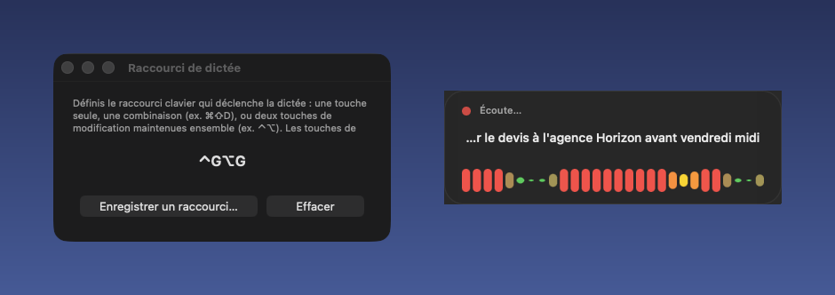

# SoTellMe

A macOS menu-bar app to dictate text anywhere with a keyboard shortcut, with **100% local transcription** (nothing is sent to a server). It is tuned to understand software-development and gaming vocabulary.

> The UI is in French; transcription handles French and English.

## Screenshot

*Shortcut settings window and the listening HUD, with a made-up dictated sentence.*



## How it works

- Press your **dictation shortcut** to start listening: a small HUD appears at the bottom of the screen with a live waveform and a preview of the transcript.
- Text is **typed live** into the focused app while you speak, and refined as the transcription improves.
- Press the shortcut again to stop; a final pass cleans up the text.
- Everything runs locally with [WhisperKit](https://github.com/argmaxinc/WhisperKit) (Whisper on CoreML, accelerated by the Neural Engine on Apple Silicon).

The shortcut is configured from the menu-bar icon → **Raccourci de dictée…**: a single key (e.g. F5), a key with modifiers (e.g. ⌘⇧D), or two modifier keys held together (e.g. ⌃⌥). Left and right modifiers are distinguished. The menu also lets you pick the microphone (with a level meter), shows missing permissions and offers **Redémarrer** / **Quitter**.

Silent recordings are skipped and common Whisper "hallucinations" on noise are filtered out.

## Build

```bash
./build_app.sh
```

Produces `dist/SoTellMe.app` (release build + bundle + signature with a stable local identity so macOS permissions survive rebuilds).

## Installation

1. Copy `dist/SoTellMe.app` to `/Applications` (optional but recommended).
2. Open it the first time with **right-click › Open** (the app isn't notarised).
3. Grant the permissions macOS asks for:
   - **Microphone**
   - **Accessibility** — needed to type the text into other apps
   - **Input Monitoring** — needed to detect the global shortcut. If no prompt appears, add `SoTellMe.app` to the list yourself and relaunch.
4. On first launch the app downloads the Whisper model (~500 MB–1 GB, once); after that everything works offline.

## Launch at login (optional)

```bash
cp -R dist/SoTellMe.app /Applications/
cp LaunchAgent/com.ngoujon.sotellme.plist ~/Library/LaunchAgents/
launchctl load ~/Library/LaunchAgents/com.ngoujon.sotellme.plist
```

To disable:

```bash
launchctl unload ~/Library/LaunchAgents/com.ngoujon.sotellme.plist
rm ~/Library/LaunchAgents/com.ngoujon.sotellme.plist
```

## Technical and gaming vocabulary

1. A bias prompt (list of tech / gaming terms) is given to the model before each transcription (`Sources/SoTellMe/Transcriber.swift`).
2. A post-transcription dictionary (`Sources/SoTellMe/Resources/vocab_corrections.json`) fixes classic mistakes ("git hub" → "GitHub", …). Edit it and rebuild to add your own terms.

## Whisper model

Default: `small` (multilingual). To reduce CPU / memory usage, pass `named: "base"` to `transcriber.loadModel()` in `AppDelegate.swift` (the default is set in `Transcriber.swift`).

## Project structure

```
Sources/SoTellMe/
  main.swift                         entry point, menu-bar app (no Dock icon)
  AppDelegate.swift                  orchestration (state, status item, live transcription)
  HotkeyManager.swift                global shortcut capture
  HotkeyBinding.swift                shortcut model (keys, left/right modifiers)
  HotkeySettingsWindowController.swift  shortcut recording window
  AudioRecorder.swift                microphone capture → 16 kHz mono PCM
  MicrophoneManager.swift            input device selection
  Transcriber.swift                  WhisperKit wrapper + vocabulary bias
  NoiseFilter.swift                  filters noise hallucinations
  VocabCorrector.swift               post-transcription corrections
  ListeningIndicator.swift           floating HUD with waveform
  TextInserter.swift                 live typing into the focused app
  Resources/vocab_corrections.json
build_app.sh                         build + bundle + sign
LaunchAgent/                         plist for launch at login (optional)
```
